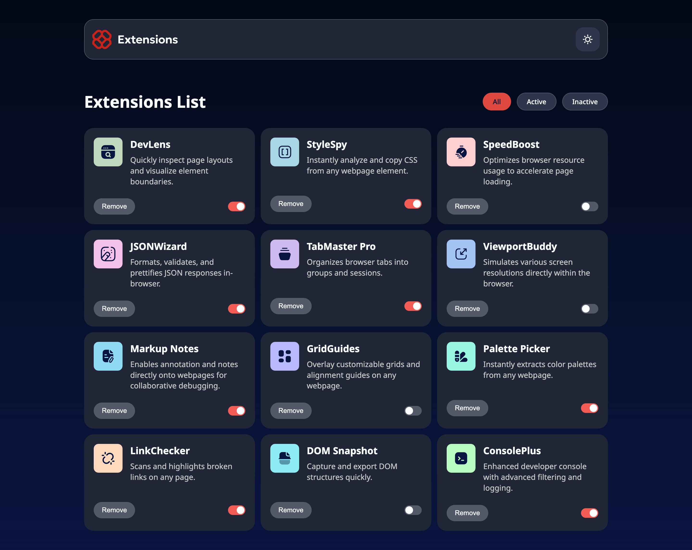

# Frontend Mentor - Browser Extensions Manager UI

This is my solution to the [Browser extensions manager UI challenge on Frontend Mentor](https://www.frontendmentor.io/challenges/browser-extension-manager-ui-yNZnOfsMAp).

The challenge was to build a responsive browser extension manager where users can filter, enable, disable and remove extensions, as well as switch between light and dark themes.

## Table of contents

- [Overview](#overview)
  - [The challenge](#the-challenge)
  - [Screenshot](#screenshot)
  - [Links](#links)
- [My process](#my-process)
  - [Built with](#built-with)
  - [What I learned](#what-i-learned)
  - [Useful resources](#useful-resources)
- [Author](#author)

## Overview

### The challenge

Users should be able to:

- Toggle extensions between active and inactive states
- Filter extensions by active or inactive status
- Remove extensions from the list
- Switch between light and dark themes
- View a responsive layout across different screen sizes
- See hover and focus states for interactive elements

### Screenshot



### Links

- [Solution on GitHub](https://github.com/edwardshanahan97/frontend-mentor-browser-extensions-ui)
- [Live site](https://edwardshanahan97.github.io/frontend-mentor-browser-extensions-ui/)

## My process

### Built with

- Semantic HTML5
- CSS custom properties
- Flexbox
- CSS Grid
- Mobile-first workflow
- React
- Vite

### What I learned

This project gave me more practice working with React state and updating arrays without mutating the existing state.

I used `filter()` to display extensions based on their status and to remove extensions from the list. I also used `map()` to update the active state of an individual extension.

```js
const toggleExtension = (id) => {
  setExtensions((prev) =>
    prev.map((extension) =>
      extension.id === id
        ? { ...extension, isActive: !extension.isActive }
        : extension,
    ),
  );
};
```

I also created the toggle switch using a hidden checkbox and CSS sibling selectors. This was something I hadn't built before.

```css
.extension-card__switch input:checked + span {
  background-color: var(--bg-switch-active);
}

.extension-card__switch input:checked + span::before {
  transform: translateX(16px);
}
```

Another thing I learned was how to detect the user's preferred system theme with `prefers-color-scheme` and use that as the initial theme.

```js
const prefersDarkMode = window.matchMedia(
  "(prefers-color-scheme: dark)",
).matches;

return prefersDarkMode ? "dark" : "light";
```

### Useful resources

- [GeeksforGeeks - Create a toggle switch using HTML and CSS](https://www.geeksforgeeks.org/css/how-to-create-toggle-switch-by-using-html-and-css/) - Helped me understand the CSS structure needed to create the extension toggle switch.

- [GeeksforGeeks - prefers-color-scheme and dark mode](https://www.geeksforgeeks.org/css/how-to-create-dark-mode-using-prefer-color-scheme-media-query/) - Useful for understanding how to detect the user's system colour scheme.

- [React Documentation](https://react.dev/) - Used as a reference while working with state and updating arrays.

## Author

- Frontend Mentor - [@edwardshanahan97](https://www.frontendmentor.io/profile/edwardshanahan97)
- GitHub - [@edwardshanahan97](https://github.com/edwardshanahan97)
